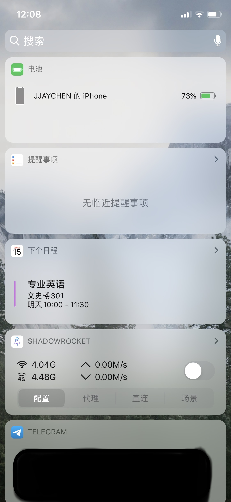
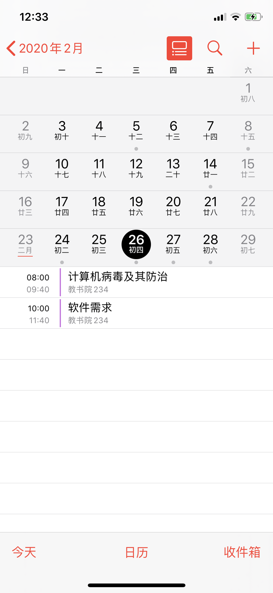
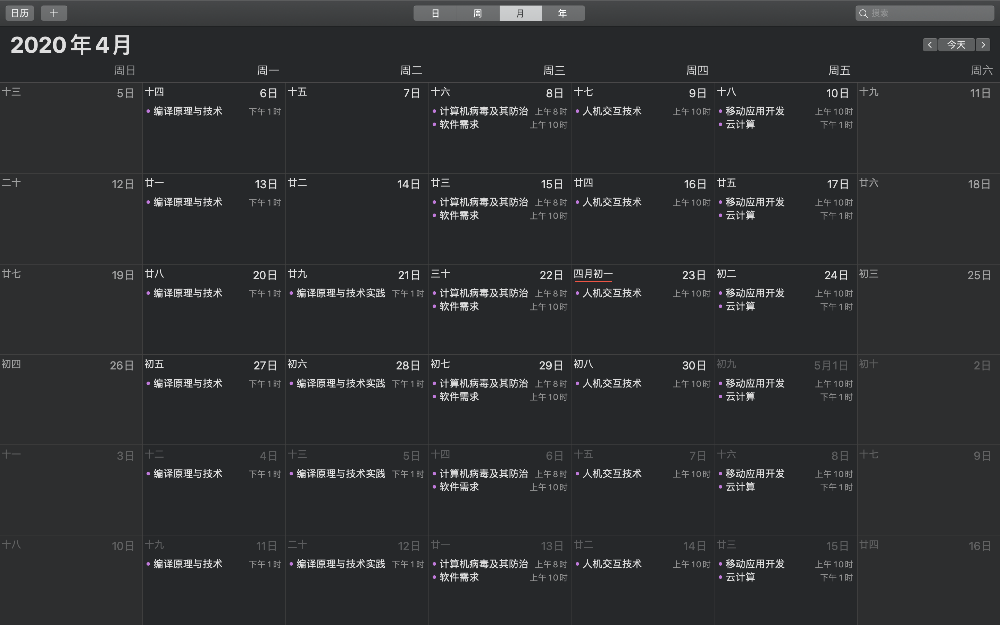

  

<h1 align="center">
Bring Your Timetable to Calendar App(ECNU)
</h1>
<h4 align="center">
A shortcut for iOS/iPadOS that can automatically bring your timetable in ECNU to Calendar app.
</h2>

  
  

## 这是什么？

这是一个为华东师范大学本科生准备的[快捷指令](https://support.apple.com/zh-cn/guide/shortcuts/apdf22b0444c/3.2/ios/13.2)。可以做到将自己的课程表自动添加至日历 app 中。配合 ”下个日程“ 组件，可以方便地知道自己的课程信息。

### 什么是快捷指令？

> [快捷指令](https://support.apple.com/zh-cn/guide/shortcuts/apdf22b0444c/3.2/ios/13.2)可让您使用 app 快速完成任务，只需轻点一下或询问 Siri 即可。
>
> 快捷指令可以自动化各种任务，例如，获取前往“日历”上下一个日程的路线、将文本从一个 App 移到另一个 App、生成支出报告等。
>
> 基于您使用 iOS 或 iPadOS 设备的方式，如 App 使用以及浏览器、电子邮件和信息历史记录，Siri 可以建议简单实用的快捷指令，快速轻点即可运行。创建快捷指令后，您可以直接召唤 Siri，然后说出快捷指令的名称即可运行它。
>
> --- 摘录自 Apple 支持

## 效果如何？

    
    
    

    	“下个日程” 组件效果 与 iPhone 日历 app 效果
    

  

Mac 日历 app 效果

  

iPad 日历 app 效果

## 怎么用？

